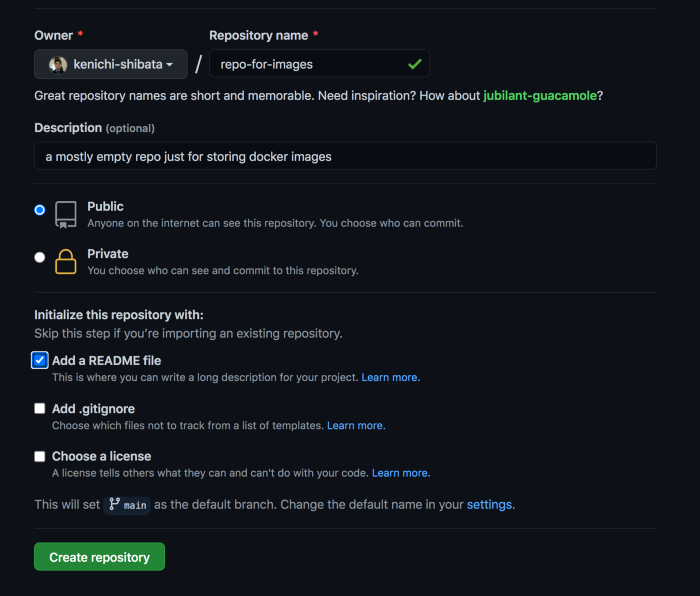
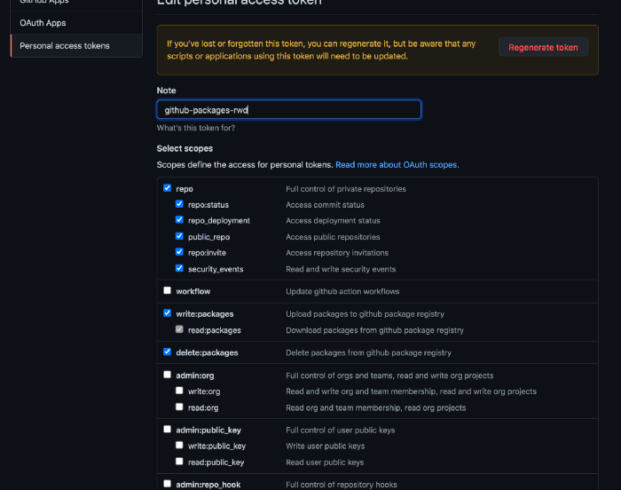

Github Packages now supports Docker Registry

One of the easiest way to setup your own Docker Registry is by using Github Packages.

Docker Registry in Github is also convenient. Having the Docker Images close to where you are storing your code allows for better developer productivity.

However setting up your first Docker Registry using Github Packages is not very well documented in my opinion. Here’s my attempt to simplify your initial setup and save you time. Read until the end for common errors and how to troubleshoot.

TLDR; Fix Docker Rate Limit issues by using Github Packages

Steps

1. Create a Github Repo where you will store your docker image / Alternatively use an existing Github Repo.

2. Create a github token in https://github.com/settings/tokens

3. Setup your github token with write:packages repo and optionally delete:packages if you need it to automatically delete packages

